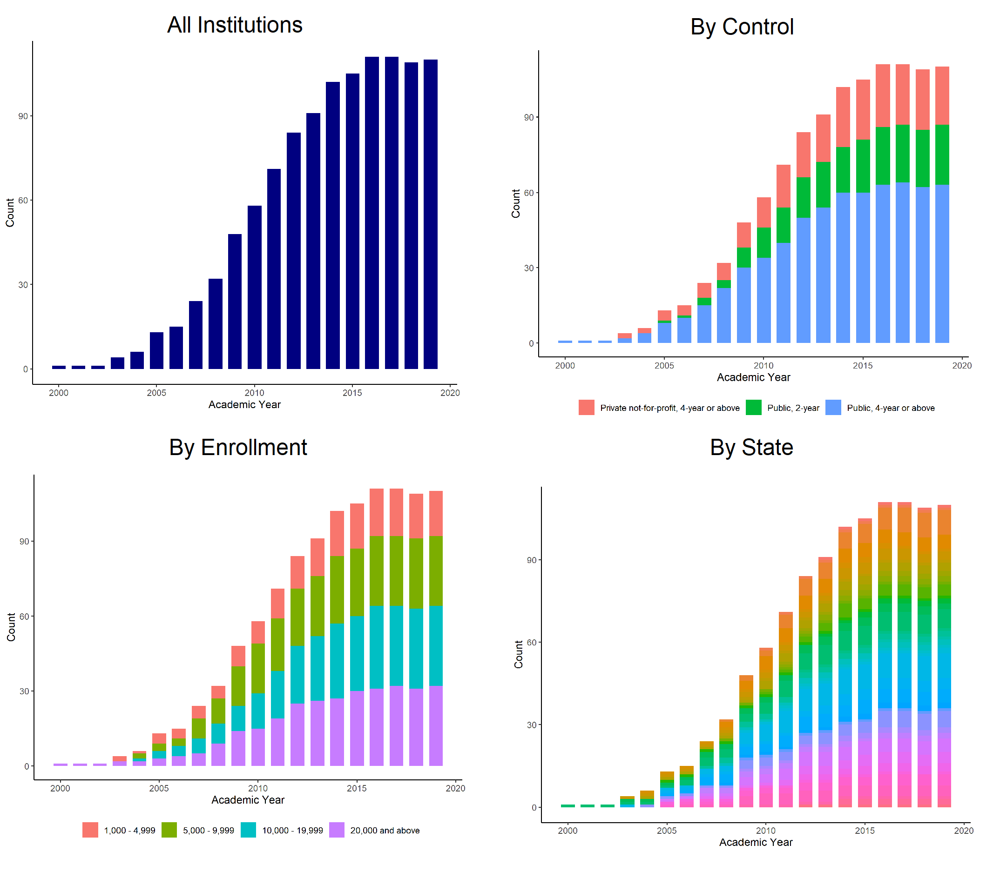
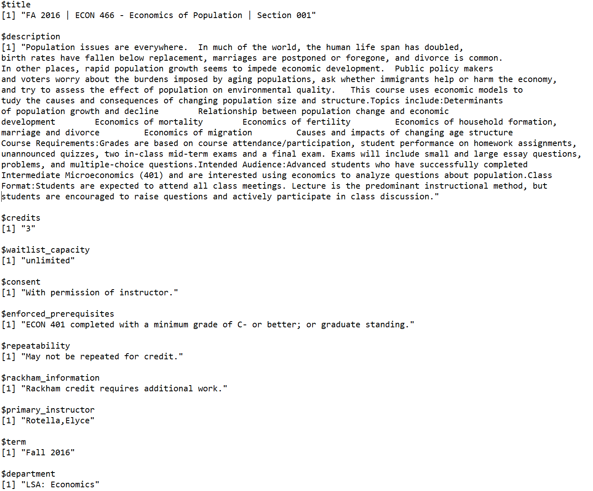

```{r setup, include=FALSE}
  library(knitr)
  knitr::opts_chunk$set(echo = TRUE)
```

The dataset underlying this project contains course descriptions from a growing sample that currently covers 5\% of non-profit degree granting colleges and universities in the United States. Colleges included in the sample are diverse along numerous dimensions. The sample contains institutions from more than 30 states, public and private institutions, two- and four-year institutions, and institutions with a wide range of student enrollment. These sources of heterogeneity will be useful for understanding how outcomes student outcomes vary by institution characteristics, while allowing me to weight the sample to better represent the average college in the United States.

The histograms below summarize characteristics of the sample. My sample is drawn primarily from catalogs in html format. When available, web catalogs are generally available from the 2015-16 academic year onward, but coverage of earlier years is sparse. I am in the process of expanding my dataset to include pdf catalogs, which are more widely available but generally tougher to scrape.

```{r image_grobs, echo = FALSE, fig.show = "hold", out.width = "80%", fig.align = "center"}
  
```


For each course, I observe the: course title, course description, academic department, number of credits, career track (undergraduate vs. graduate), and any pre-requisites. Some institutions provide additional detail in the course description, such as instructor name or course enrollment. The figure below is an example of a typical observation in this dataset.

```{r ex, echo = FALSE, fig.show = "hold", out.width = "80%", fig.align = "center"}
  
```

## Takeaways:

1. New, exciting dataset currently contains a diverse set of institutions and covers primarily 2010-2020.

2. Working on expanding and diversifying the dataset.

3. Course catalogs widely available online, in common format for easy scraping.