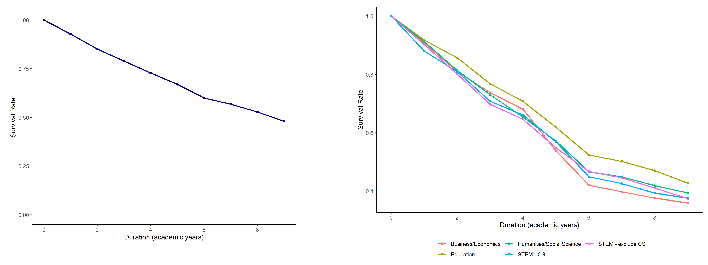

```{r setup, include=FALSE}
knitr::opts_chunk$set(echo = TRUE)
```

The "Major Skills" project asks how colleges and universities respond to labor market shocks. Students choose the college they will attend and their college major to maximize their return on college attendance. The skills a student develops in college, as well as her innate aptitude, are valuable in the labor market. However, students face some uncertainty in their return on investment: globalization, the economy, and technology may increase or decrease the return to skills developed in college throughout a worker's career. Universities compete to attract high aptitude students and equip these students with the skills to excel in the labor force. 

As skill demand in the labor force changes, how do universities adapt their course offerings? In practice, an institution can adjust course offerings along two dimensions: an **intensive margin**, through which an institution changes the content of an existing course, or an **extensive margin**, through which an institution introduces a new course. Below, I use the course catalog data to evaluate the extent to which institutions have evolved along intensive and extensive margins.

**Intensive Margin Responses**: First, I calculate the survival rate for course descriptions over a ten year period. I subset to courses offered continuously between 2010-11 and 2019-20. The survival function plots the share of courses with unchanged course description in each year 2010-11. Panel A plots the survival rate across all courses, while Panel B plots survival rates for five categories of college majors. The figures suggest that existing courses evolve slowly; the median course description is updated once per eight years. Survival rates are comparable across majors.

```{r surv, echo = FALSE, fig.show = "hold", out.width = "100%", fig.align = "center", fig.cap = "Course Description Survival Function", fig.topcaption = TRUE}
  
```

**Extensive Margin Responses**: Next, I calculate adjustment along the extensive margin through new course offerings. The figure counts the number of courses offered in each academic year for the panel of institutions covered 2010-2020 in my dataset, normalized to the number of courses offered in 2010-11. Panel A plots the overall trend in course offerings, which have steadily increased over time. The upward trend is consistent with increasing college enrollment, competition for smaller course sizes, and expanded access to colleges through the Common App. Panel B plots separate trends by major category. Growth in course offerings for STEM and Computer Science classes is most striking. The growth in Computer Science courses coincides with the introduction of information and data science courses at many colleges, as well as steadily increasing growth in the share of college graduates who major in STEM fields.

```{r growth, echo = FALSE, fig.show = "hold", out.width = "100%", fig.align = "center", fig.cap = "Growth in Course Offerings", fig.topcaption = TRUE}
  knitr::include_graphics('images/growth_paper.png')
```


**Takeaways**:

  1. Existing courses in each category of college major evolve gradually. The typical course description is updated approximately once every seven years, suggesting that a long panel is necessary to document content changes over time
  
  2. New course offerings have grown substantially in the last ten years. The general upward trend coincides with growing college enrollment and competition for smaller class sizes
  
  3. The explosion of computer science courses over the last five years is particularly striking. Much of this growth arises from the introduction of data science and machine learning courses, contemporaneous with growth in labor market skill demand
