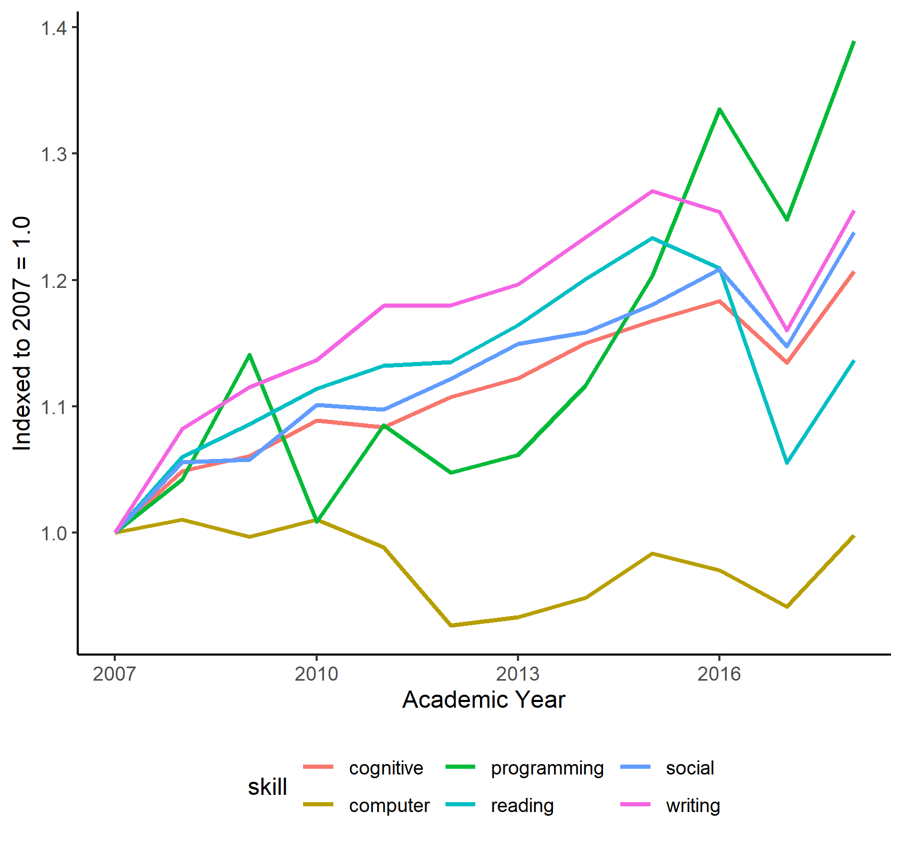

```{r setup, include=FALSE}
knitr::opts_chunk$set(echo = TRUE)
```


Deming and Kahn (2018) identify ten skill domains that explain earnings differentials across labor markets: cognitive, social, character, writing, customer service, project management, people management, financial, computer (general), and software (specific). Deming and Kahn score Burning Glass job listings data for intensity in these skill domains by searching in job descriptions for key words or phrases associated with each skill domains. I replicate the spirit of their analysis by searching in my course description dataset for their key words and phrases linked to a subset of their skill domains.

```{r dk, echo = FALSE, fig.show = "hold", out.width = "75%", fig.align = "center", fig.cap = "Deming and Kahn (2018), Table 1", fig.topcaption = TRUE}
  knitr::include_graphics('images/DemingKahn.png')
```


First, I demonstrate that students are widely exposed to high-return skills in their college classes. The figure below summarizes skill exposure across six skill domains. The bars show the share of courses with at least one word or phrase that matches Deming and Kahn's keyword list. Among the skill domains, college courses are most intensive in cognitive and social skills - the two categories Deming and Kahn highlight for high return. The left panel of the figure below calculates skill intensity across all institutions in the 2019-20 academic year; the right panel calculates skill intensity for just the University of Michigan, one of the most selective institutions in the course catalog dataset. Other highly selective institutions in the dataset are similarly more intensive in high-return skill domains than less selective institutions.

```{r skill, echo = FALSE, fig.show = "hold", out.width = "100%", fig.align = "center", fig.cap = "Skill Content of Course Offerings", fig.topcaption = TRUE}
  knitr::include_graphics('images/Mich_plot.png')
```

Having demonstrated that the course description data enable detection of high-return skills, I next study changes in skill offerings over time. I view this analysis as complementary to Hershbein and Kahn (2017). For this analysis, I subset the course catalog dataset to institutions that I can observe for the period 2007-2017, both to observe pre- and post-Great Recession and to observe a relatively long panel.  

The figure below plots changes in skill offerings over time, relative to the courses offered in 2007-08. The figure shows that college courses have become relatively more intensive in cognitive, social, and writing skills since 2007, with a modest spike coinciding with the Great Recession. Courses emphasizing basic computer skills have declined. The most striking feature of the figure is the spike in the number of courses teaching programming skills over the last 5 years. Two possible explanations can describe the growth in programming courses. First, course offerings are responding to technological advances complementary to programming skills. Second, the phrases Deming and Kahn associate with programming skills are biased towards programming skills in use today rather than rewarded by the labor market in 2007. Either explanation would be interesting and policy-relevant.

```{r time, echo = FALSE, fig.show = "hold", out.width = "75%", fig.align = "center", fig.cap = "Skill Offerings Over Time (Indexed to 2007 = 1.0)", fig.topcaption = TRUE}
  
```


**Takeaways**:

  1. 
  
  2. 
  
  3. 

**Sources**:

Deming, David, and Lisa B. Kahn. ``Skill requirements across firms and labor markets: Evidence from job postings for professionals.'' Journal of Labor Economics 36, no. S1 (2018): S337-S369.

Hershbein, Brad, and Lisa B. Kahn. ``Do recessions accelerate routine-biased technological change? Evidence from vacancy postings.'' American Economic Review 108, no. 7 (2018): 1737-72.
